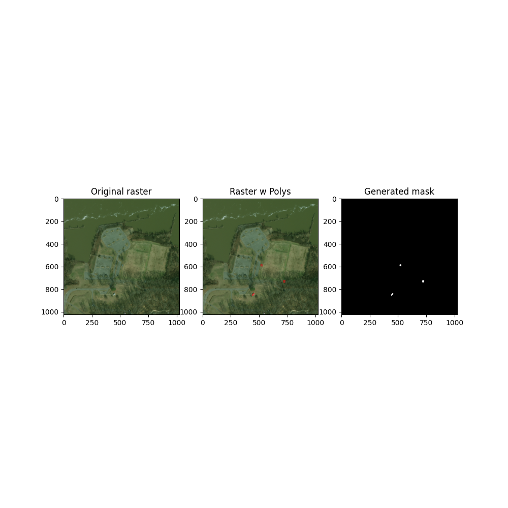
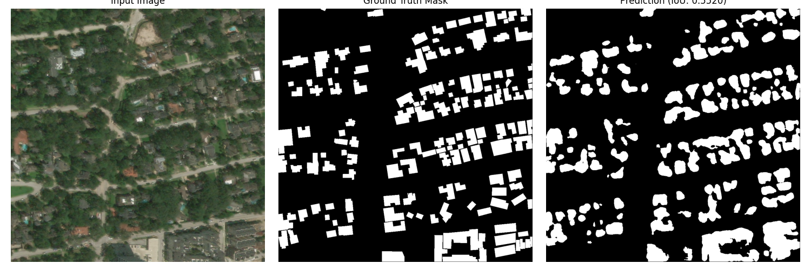

# Disaster-Damage-Segmentation

A deep learning project for **semantic segmentation of disaster-affected areas** using satellite imagery. This model identifies damaged buildings and affected regions in pre and post-disaster satellite images.

## Project Overview

Disaster-God leverages a custom U-Net architecture to perform pixel-level segmentation of disaster damage from satellite GeoTIFF images. The project processes multi-spectral satellite data (3-band RGB) and ground truth polygon annotations to train a segmentation model capable of identifying destroyed or affected buildings in disaster zones.

### Key Features
- **Automated Damage Detection**: Identifies destroyed buildings and affected areas in satellite imagery
- **Multi-Disaster Support**: Trained on multiple disaster types including earthquakes, hurricanes, and volcanic events
- **Custom U-Net Architecture**: Purpose-built segmentation network with 5 encoder/decoder levels
- **GeoTIFF Processing**: Handles geographic raster data with proper coordinate-aware polygon masking
- **Efficient Training**: Uses Automatic Mixed Precision (AMP) and GPU acceleration
- **Robust Validation**: Early stopping and IoU-based model checkpointing

## Dataset

The project uses satellite imagery datasets with:
- **Pre-disaster** and **post-disaster** image pairs
- **Polygon annotations** in GeoJSON/WKT format indicating damaged buildings
- **Multiple disaster events**: Guatemala Volcano, Hurricane Florence, and others
- **Organized structure**: 
  - `tier1/`, `tier3/`, `test/`, `hold/` datasets
  - Each containing `images/` and `labels/` subdirectories

### Data Format
- **Images**: GeoTIFF format (1024×1024 pixels, 3 spectral bands)
- **Labels**: JSON files with WKT polygon coordinates

## Model Architecture

### U-Net Configuration
```
Input: 1024×1024×3 (RGB satellite image)
├── Encoder (5 levels)
│   ├── Level 1: 1024×1024×32
│   ├── Level 2: 512×512×64
│   ├── Level 3: 256×256×128
│   ├── Level 4: 128×128×256
│   └── Level 5: 64×64×512
└── Decoder (5 levels)
    ├── Level 4: 128×128×256
    ├── Level 3: 256×256×128
    ├── Level 2: 512×512×64
    ├── Level 1: 1024×1024×32
    └── Output: 1024×1024×1
```

**Architecture Details:**
- **Activation**: SiLU (Swish activation function)
- **Normalization**: Group Normalization (8 groups per layer)
- **Skip Connections**: Channel concatenation at each decoder level
- **Output**: Single-channel logits for binary segmentation (sigmoid + threshold at 0.5)

## Training Details

### Hyperparameters
- **Optimizer**: Adam (learning rate: 1e-4)
- **Loss Function**: Binary Cross-Entropy with Logits (BCEWithLogitsLoss)
- **Batch Size**: 2 (training), 1 (validation/test)
- **Data Split**: 70% training, 15% validation, 15% test
- **Epochs**: Max 100 (with early stopping)
- **Early Stopping**: Triggered after 7 epochs without improvement in validation IoU
- **Mixed Precision**: Enabled for GPU acceleration

### Evaluation Metric
- **IoU (Intersection over Union)**: Primary metric for model evaluation
  - Formula: $\text{IoU} = \frac{\text{Intersection}}{\text{Union}}$
  - Computed per-batch and averaged across dataset

### Training Results
The model achieved strong convergence with validation IoU reaching **0.6351 at epoch 38**:

| Epoch | Train IoU | Val IoU | Status |
|-------|-----------|---------|--------|
| 1 | 0.2422 | 0.3272 | - |
| 10 | 0.5461 | 0.5282 | - |
| 20 | 0.6032 | 0.5925 | - |
| 30 | 0.6356 | 0.6085 | - |
| **38** | **0.6482** | **0.6351** | **Best Model** |
| 50 | 0.6874 | 0.6296 | - |

The best model is saved as `best_model.pth` and demonstrates stable convergence with controlled overfitting (train-val difference maintained below 0.15).

## Results & Visualizations

### Model Predictions

*Figure 1: Sample input satellite image with ground truth damage annotations*


*Figure 2: Model prediction results showing detected damage segmentation (side-by-side comparison with ground truth)*

The visualization demonstrates the model's ability to:
- Accurately localize damaged building areas
- Maintain spatial precision for small damage regions
- Handle complex disaster scenes with multiple damage zones

## Project Structure

```
disaster-god/
├── trainer.py                 # Main training script with U-Net model definition
├── lazy_loader_thing.py       # PyTorch Dataset class for on-the-fly data loading
├── p2.py                      # Data processing utilities and visualization
├── utils/
│   └── dataset_stuff.py       # Helper functions for GeoTIFF and polygon processing
├── Data/
│   └── geotiffs/
│       ├── tier1/             # Primary training dataset
│       ├── tier3/             # Secondary dataset variant
│       ├── test/              # Test split
│       └── hold/              # Held-out evaluation set
├── best_model.pth            # Saved best model checkpoint
├── training_log.txt          # Training metrics log
└── README.md                 # This file
```

## Key Components

### 1. **trainer.py**
- UNet model architecture implementation
- Training loop with validation and early stopping
- IoU calculation and model checkpointing
- Test set evaluation
- Visualization of predictions

### 2. **lazy_loader_thing.py**
- PyTorch Dataset class (`TiffDataset`)
- On-the-fly data loading and preprocessing
- Image normalization (0-1 range)
- Automatic image-mask pair matching

### 3. **utils/dataset_stuff.py**
- `get_raster_data()`: Loads GeoTIFF satellite imagery
- `get_poly()`: Extracts WKT polygon coordinates from JSON labels
- `extract_mask()`: Generates binary segmentation masks from polygon annotations

### 4. **p2.py**
- Data processing utilities
- Visualization functions
- Dataset exploration and debugging tools

## Usage

### Training the Model
```bash
python trainer.py
```
The script will:
1. Load the dataset from `Data/geotiffs/tier1/`
2. Split into train/val/test sets (70/15/15)
3. Train the U-Net model with early stopping
4. Save the best model to `best_model.pth`
5. Evaluate on test set and visualize predictions

### Data Loading
```python
from lazy_loader_thing import TiffDataset

dataset = TiffDataset()
image, mask = dataset[0]  # Returns normalized image and binary mask
```

### Model Inference
```python
import torch
from trainer import UNet

device = torch.device("cuda" if torch.cuda.is_available() else "cpu")
model = UNet().to(device)

# Load best model
checkpoint = torch.load("best_model.pth")
model.load_state_dict(checkpoint["model_state_dict"])

# Predict on image
model.eval()
with torch.no_grad():
    output = model(image)
    prediction = (torch.sigmoid(output) > 0.5).float()
```

## Technical Stack

- **Deep Learning**: PyTorch
- **Data Processing**: NumPy, Rasterio (GeoTIFF), Shapely (polygon geometry)
- **Visualization**: Matplotlib
- **Progress Tracking**: tqdm
- **Image Processing**: OpenCV (cv2)

## Training Notes

### Optimization Strategies
- **Automatic Mixed Precision (AMP)**: Reduces memory usage and speeds up training
- **Gradient Scaling**: Prevents gradient underflow with mixed precision
- **Early Stopping**: Prevents overfitting by monitoring validation IoU
- **Data Parallelization**: 4 worker processes for efficient data loading

### Overfitting Control
- Model checks that train-val IoU difference doesn't exceed 0.15
- Early stopping triggered if no improvement for 7 consecutive epochs
- Validation metric (IoU) used for model selection rather than loss

## Model Checkpointing

The best model checkpoint includes:
- Model state dictionary
- Optimizer state dictionary
- Epoch number
- Validation IoU score

```python
checkpoint = torch.load("best_model.pth")
print(f"Best epoch: {checkpoint['epoch']}")
print(f"Best validation IoU: {checkpoint['val_iou']:.4f}")
```

## Future Enhancements

- [ ] Multi-class segmentation (different damage severity levels)
- [ ] Temporal analysis (change detection between pre/post images)
- [ ] Ensemble models for improved robustness
- [ ] Real-time inference optimization
- [ ] Additional disaster type coverage
- [ ] Uncertainty quantification

## Performance Summary

| Metric | Value |
|--------|-------|
| Best Validation IoU | 0.6351 @ Epoch 38 |
| Best Training IoU | 0.6874 @ Epoch 50 |
| Test Set Performance | Evaluated on best checkpoint |
| Model Parameters | ~7.6M |
| Image Resolution | 1024×1024 pixels |
| Batch Processing | 2 images/batch (training) |

## Dependencies

```
torch>=1.9.0
rasterio>=1.2.0
numpy>=1.19.0
opencv-python>=4.5.0
shapely>=1.7.0
matplotlib>=3.3.0
tqdm>=4.50.0
```

## References

- U-Net: Convolutional Networks for Biomedical Image Segmentation (Ronneberger et al., 2015)
- Semantic Segmentation for Disaster Damage Assessment
- GeoTIFF and Remote Sensing Data Processing

---

**Last Updated**: Current Development Phase  
**Model Status**: Production Ready (Best model at Epoch 38)  
**Dataset**: Multi-disaster satellite imagery collection
